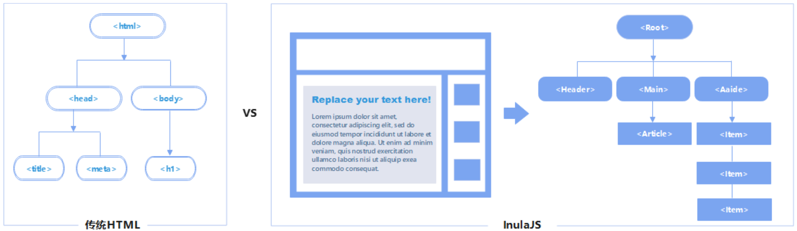

# 用户指南

openInula 是一款构建用户界面的 JavaScript 前端框架。本篇文章会对 openInula 的组件及生命周期、数据管理、事件绑定等知识进行详细介绍，相信通过本章学习您将掌握到 openinula 的基本知识和使用方法。

## 开始使用

### JSX

JSX 是 JavaScript XML 的缩写，是一种用于构建用户界面的语法扩展。在 openInula 中，JSX 被广泛使用。开发者可以使用 JSX 来描述 UI 组件的结构和样式，并将其与 JavaScript 代码逻辑相结合。然后使用转译工具（例如`Babel`）将 JSX 代码转换为普通的 JavaScript 代码，以便浏览器能够理解并渲染。

- JSX 是类 HTML 语言，其除了拥有 HTML 的功能外，还可以通过括号`{}`嵌套 JavaScript 表达式，这使得 JSX 更加灵活，可以动态地生成UI组件；
- JSX 支持双向数据绑定，使得数据和界面之间的更新更加简单。当数据发生变化时，会智能地更新必要部分。HTML 没有直接支持数据绑定的功能；
- 每个 JSX 必须返回独有元素。如果要返回多个顶级元素，请使用 `Fragment` 元素或者 <></>。

```tsx
<>
  <h1>Hello, {props.name}!</h1>;
  <Pictures/>
  <Counter/>
</>
```

### 组件

组件是 openInula 的核心概念之一。它们是构建用户界面（UI）的基础，是可重用和独立的代码单元。开发者可以将相关功能、状态以及模板封装在组件中，提高可复用性，使得程序开发具备模块化和可维护特性。下面我们将展开介绍。

#### 组件的设计

组件不是 openInula 特有的概念，但是组件的设计思想会是优秀应用开发的基础。接下来我们就谈一谈组件设计的奥秘。

openInula 组件思想具有普适性，无论是在其他框架还是原生 Web component 都适用。组件与我们之前学到的HTML的元素非常相似，如将一个 UI 界面分成独立的可重复复用的单独的部分，每个部称之为一个组件，各个组件之间相互交互以实现基本功能。



如果您已经了解使用组件会给您的程序带来的优点，如何设计一个好的组件将是您接下来关注的问题，openInula 框架认为一个好的组件会遵循以下原则：

1. 单一职责：组件只应该做一件事情。单一职责带来最大好处就是在修改组件时，不必担心对其他组件造成影响。
2. 开闭原则：一个组件应该对扩展开放，对修改关闭，即通过扩展组件的行为来实现功能的变化，而不是修改组件的源代码。

上述原则可以帮助开发者设计出高内聚、低耦合、可扩展、可维护的组件。如下示例是我们展示如何使用设计原则来实现一个安全可靠的组件。

```tsx
import Inula, { render, Component } from 'openinula';

// 示例组件 - 按钮组件
class Button extends Component {
  render() {
    const { text, onClick } = this.props;
    return (
      <button onClick={onClick}>{text}</button>
    );
  }
}

// 示例组件 - 表单组件
class Form extends Component {
  handleSubmit = (event) => {
    event.preventDefault();
    // 处理表单提交逻辑
  }

  render() {
    return (
      <form onSubmit={this.handleSubmit}>
        <input type="请输入文本" />
        <Button text="提交" onClick={this.handleSubmit} />
      </form>
    );
  };
}

// 示例组件 - 页面组件
class Page extends Component {
  render() {
    return (
      <div>
        <h1>示例页面</h1>
        <Form />
      </div>
    );
  };
}

// 渲染页面
render(<Page />, document.getElementById('root'));
```

这个示例只是一个简单的演示，它展示了一个简单的按钮组件 `Button`，表单组件 `Form`，以及页面组件 `Page`。这些组件遵循了常见的组件原则， 满足了组件的可重用、可组合、可测试以及可维护等特性。

#### 组件的分类

我们从组件的设计中了解到为什么要使用组件？那我们如何定义、实现一个组件将是开发者关注的另一个问题。openInula 框架中支持函数式组件和类组件的实现，开发者可根据项目实际情况、编码习惯来选择。

1. 类组件

    类组件通过继承 `Component` 类来创建，类组件具备自己内部状态（`state`），它可以在组件的生命周期中进行管理，类组件会使用 `render` 方法返回 JSX 元素，并可以通过定义其他方法来处理事件、状态更新等操作。下述示例定义了一个类组件`Counter`，并在类组件中进行了状态设置、修改等操作。

    ```tsx
    import Inula, { Component } from 'openinula';

    export class Counter extends Component {
      constructor(props) {
        super(props);
        this.state = { count: 0 };
      }

      increment() {
        this.setState({ count: this.state.count + 1 });
      };

      render() {
        return (
          <div>
            <p>Count: {this.state.count}</p>
            <button onClick={() => this.increment()}>Increment</button>
          </div>
        );
      };
    };
    ```

2. 函数组件

    函数组件是以函数形式呈现，可以接收一个属性（`props`）作为输入，并返回一个 JSX 元素。函数组件的代码量更少，易于阅读和理解。相较于类组件，没有繁琐的类声明和生命周期方法，更加直观和简洁。此外，函数组件没有实例化的过程，在一些情况下，函数组件比类组件具有更好的性能。

    ```tsx
    funtion Picture() {
      return (
        
      );
    };

    const Greeting = (props) => {
      return （
        <div>
          <h1>Hello, {props.name}!</h1>
          <Picture/>
        </div>
      );
    };
    ```

此外，无论是函数组件还是类组件，组件之间可以进行嵌套，实现更复杂的代码逻辑。在上述函数组件示例中包含了两个组件，`Greeting`为父组件，`Picture`是它的子组件。

> 注意：
> 1. 如果定义组件，则首字母需要大写，以区分 HTML 标签；
> 2. 在渲染JSX元素时，`return` 时需要通过括号`()`包含多个组件，否则 `return` 中除首行代码外都会被忽略。

#### 组件的渲染

我们已经介绍了函数组件和类组件，下一步我们将思考如何能将创建的组件展示到界面？首先我们创建了一个 `index.jsx` 文件，使用 `document.getElementById('root')` 表示获取HTML文档中具有id为 `root` 的元素作为挂载点，进而在浏览器中展示 `Counter` 组件内容。

```tsx
import { render } from 'openinula';
import { Counter } from './Counter.js'

function App() {
  render(
    <Counter/>, 
    document.getElementById('root')
  );
};
```

### 组件间通信

#### Props（属性）

Props（属性）是组件之间传递数据的一种机制。Props 是从父组件向子组件传递的不可变对象。Props 的参数传递是一种单向传递，即从父组件单向传递子组件，因此 Prop 是一种只读属性，子组件只能读取父组件传递的 Props，但却不能修改值。在如下示例中，我们创建一个父组件 `ParentComponent`，通过 Props 机制将参数传递给子组件 `ChildComponent`。

```tsx
function ParentComponent() {
  // 创建一个props参数
  const props = {
    name: "Jack",
    age: "25",
  };

  return (
    <ChildComponent props={props}/>
  );
}

// 类组件
class ChildComponent extends Component {
  render() {
    const { name, age, gender } = this.props;
    return (
      <div>
        <p>Name: {name}</p>
        <p>Age: {age}</p>
        <p>Gender: {gender || 'Unknown'}</p>
      </div>
    );
  }
}

// 函数组件
function ChildComponent(props) {
  return (
    <div>
      <p>Name: {props.name}</p>
      <p>Age: {props.age}</p>
      <p>Gender: {props.gender || 'Unknown'}</p>
    </div>
  );
}
```

在上述代码中，子组件 `ChildComponent` 通过 Props 机制可以获取到父组件传入的 `props` 并获取 `name`、`age` 以及 `gender` 等值。

```jsx
<p>Name: {props.name}</p>
```

有些读者可能已经发现，父组件传入的 `props` 中没有 `gender` 属性。但是如果子组件执意使用时，也可传入默认值。在上述例子中，当父组件没有传入对应属性 `props.gender` 时，可以设置默认值为`Unknown`，如果没有设置对应属性的默认值，则获取到的值为 `undefined`。

#### State（状态）

openInula 中 State（状态） 是一种用于存储和管理组件内部数据的机制。它是一个对象，包含了组件的可变数据。当状态发生变化时会自动重新渲染组件，以反映最新的状态。

在介绍组件的分类时，我们在[类组件](#组件的分类)中定义了 `Counter` 组件让读者更直观地感受类组件特点，在 `Counter` 类组件中，我们使用 `this.state = { count: 0 }` 定义了计数器的初始状态值，并通过 `setState` 函数进行修改状态。但是这只是针对类组件中的状态的设置以及修改，如果在函数组件中，我们又如何使用呢？

下面示例中我们将类组件 `Counter` 改写写成函数组件，用 `useState` 钩子函数来声明管理组件的状态，因此代码也可以写为：

```tsx
import Inula, { useState } from 'openinula';

function Counter() {
  const [count, setCount] = useState(0);

  const increment = () => {
    setCount(count + 1);
  };

  return (
    <div>
      <p>Count: {count}</p>
      <button onClick={increment}>Increment</button>
    </div>
  );
}
```

`useState` 钩子用于定义名为 `count` 的状态变量，并使用初始值0进行初始化。同时返回的 `setCount` 函数用于更新 `count` 的值。当用户点击 `Increment` 按钮时，会触发 `increment` 函数并进一步调用 `setCount` 来增加计数器的值，并更新组件的状态。每次 `setCount` 被调用时会重新渲染 `Counter` 组件，并显示最新的计数值。

> Tips: `state` 与 `props`区别
> `state` 是组件内部管理的可变数据，用于存储和更新组件的私有状态。而 `props` 是由父组件传递给子组件的不可变数据，用于组件之间的数据传递和通信。通过结合使用 `state` 和 `props`，可以实现动态的和可重用的组件，并在应用中管理和传递数据。

#### 组件通信的封装性

openInula 提倡开发者使用组件，对于单个组件来说，单一职责原则会保证组件的封装性，但是组件之间的应该存在必要的交互通信，才能相互协作协作，完整更复杂的功能逻辑。细心的读者已经发现在上述的例子中，我们已经使用 `props` 和 `state` 来进行组件的交互，但是如何在保证组件交互时同样具备封装性呢？下面我们通过一个错误案例以及对其的修改进行详细说明。

```tsx
// ParentComponent.js
import Inula, { Component } from 'openinula';
import ChildComponent from './ChildComponent';

class ParentComponent extends Component {
  constructor(props) {
    super(props);
    this.state = {
      message: 'Hello',
    };
  }

  handleChange = (e) => {
    this.setState({ message: e.target.value });
  };

  render() {
    return (
      <div>
        <input type="text" value={this.state.message} onChange={this.handleChange} />
        <ChildComponent message={this.state.message} />
      </div>
    );
  }
}

// ChildComponent.js
import Inula, { Component } from 'openinula';

class ChildComponent extends Component {
  render() {
    return <div>{this.props.message}</div>;
  }
}
```

在上述示例中，`ParentComponent` 和 `ChildComponent` 是两个组件。然而，`ParentComponent` 直接将自己的状态（`message`）传递给了 `ChildComponent` 作为 `props` ，这违背了组件封装性的原则。

根据组件封装性的原则，一个组件应该尽可能地隐藏其内部实现细节，并通过 `props` 接口与外部进行通信。但在这个示例中，`ParentComponent` 将自己的状态直接传递给了 `ChildComponent`，导致 `ChildComponent` 依赖于 `ParentComponent` 的状态。

因此，我们在重构中，首先会考虑到以“粗暴、直接地”方式修改 `message` 值，并且考虑到组件的封装特性，保证组件只感知到自身的 `state`。我们可以将 `ChildComponent` 中的 `message` 属性改为通过 `props` 传递一个回调函数，然后在 `ParentComponent` 中定义这个回调函数，将 `message` 作为参数传递给它，最后在 `ChildComponent` 中调用这个回调函数来获取 `message`。

修改后的代码如下：

```tsx
// ParentComponent.js
import Inula, { Component } from 'openinula';
import ChildComponent from './ChildComponent';

class ParentComponent extends Component {
  constructor(props) {
    super(props);
    this.state = {
      message: 'Hello',
    };
  }

  handleChange = (e) => {
    this.setState({ message: e.target.value });
  };

  render() {
    return (
      <div>
        <input type='text' value={this.state.message} onChange={this.handleChange} />
        <ChildComponent getMessage={() => this.state.message} />
      </div>
    );
  };
}


// ChildComponent.js
import Inula, { Component } from 'openinula';

class ChildComponent extends Component {
  render() {
    return <div>{this.props.getMessage()}</div>;
  };
}

export default ParentComponent;
```

这样，我们通过回调函数的方式，将 `message` 的获取封装在了 `ParentComponent` 中，`ChildComponent` 组件就不需要再知道 `ParentComponent` 组件的内部情况，保证了 `ChildComponent` 的封装性。

### 条件渲染与列表渲染

条件渲染与列表渲染是 openInula 中常用的功能，条件渲染的方式可以根据不同的情况来显示不同的内容，提高用户体验。列表渲染可以简化代码逻辑，更便捷的开发代码。因此，JSX 也满足在 openInula 中可以实现条件渲染以及列表渲染。

1. **条件渲染**：使用 if 条件语句或三元表达式来实现条件渲染。

    ```jsx
    function UserGreeting(props) {
      return <h1>Welcome back!</h1>;
    }

    function GuestGreeting(props) {
      return <h1>Please sign up.</h1>;
    }

    // 直接使用 if-else 语句
    function Example(props) {
      const isLoggedIn = props.isLoggedIn;
      if (isLoggedIn) {
        return <UserGreeting />;
      }
      return <GuestGreeting />;
    }

    // 使用三元表达式
    function Example(props) {
      const isLoggedIn = props.isLoggedIn;
      return (
        {isLoggedIn ? <UserGreeting /> : <GuestGreeting />}
      );
    }
    ```

    在这个示例中我们定义了两种问候用户的组件 `<UserGreeting>` 与 `<GuestGreeting>`，并希望根据用户是否登录 `isLoggedIn` 分别展示前后者。我们可以使用 if-else 语句分别返回不同的组件，也可以通过三元表达式择一返回。


2. **列表渲染**：使用 for 循环或 `map` 来实现组件列表渲染。

    ```tsx
    function List(props) {
      const items = props.items.map((item, index) => (
        <li key={index}>{item}</li>
      ));

      return <ul>{items}</ul>;
    }

    function App() {
      const items = ['Item 1', 'Item 2', 'Item 3'];

      return (
        <div>
          <h1>List Demo</h1>
          <List items={items} />
        </div>
      );
    }
    ```

    在这个示例中，我们定义了一个 `List` 组件，它接收一个 `items` 属性，该属性是一个字符串数组。我们使用 `map` 函数将每个字符串转换为一个 `<li>` 元素，并将它们存储在一个 `items` 数组中。最后，我们将这个数组作为子元素传递给 `<ul>` 元素，以渲染整个列表。

### 事件

openInula 中支持事件是为了实现交互性和动态性的用户界面，通过在组件中定义事件处理函数，可以将用户的操作与组件的状态和行为关联起来。当用户触发事件时，openInula 会调用相应的事件处理函数，并根据需要更新组件的状态或执行其他操作，从而实现动态的用户界面。

openInula组件感知到用户触发事件是通过 `onXxxx` 属性来监听 DOM 事件，并在事件触发时执行事件的处理函数。因此在 openInula 中必须定义一个事件处理函数，在使用时只需要传递事件即可。

> 事件的命名规则：on+驼峰形式事件名 = 事件处理函数

#### 事件处理函数的定义

事件处理函数其实就是一个函数，它被用来响应特定的事件。当事件被处理时，事件函数就会被触发。

```tsx
function handleClick() {
   // 处理点击事件的逻辑
  console.log('Button clicked!');
}
```

#### 事件处理函数的触发

在openInula中，我们使用`onXxxx`属性来绑定事件处理函数，例如，使用`onClick`属性来绑定点击事件。函数绑定为了确保事件处理函数可以正确地访问组件实例的上下文（`this`）。有几种方法可以实现函数绑定：

1. 在构造函数中使用 `bind` 方法绑定函数

    ```tsx
    class App extends Component {
      constructor(props) {
        super(props);
        this.handleClick = this.handleClick.bind(this);
      }

      onHandleClick() {
        // 处理点击事件的逻辑
        console.log('Button clicked!');
      };

      render() {
        return <button onClick={this.onHandleClick}>Click me</button>;
      };
    };
    ```

2. 使用箭头函数定义事件处理函数

    ```tsx
    class App extends Component {
      handleClick = () => {
        // 处理点击事件的逻辑
        console.log('Button clicked!');
      };

      render() {
        return <button onClick={this.handleClick}>Click me</button>;
      };
    };
    ```

    > 箭头函数可以避免`this`指向问题，是因为箭头函数没有自己的`this`，它会继承外层函数的`this`。

#### openInula支持的事件

- Clipboard Events 剪切板事件
  - 事件名: `onCopy`, `onCut`, `onPaste`
  - 属性: `DOMDataTransfer`, `clipboardData`
- compositionEvent 复合事件
  - 事件名: `onCompositionEnd`, `onCompositionStart`, `onCompositionUpdate`
  - 属性: `string`, `data`
- Keyboard Events 键盘事件
  - 事件名: `onKeyDown`, `onKeyPress`, `onKeyUp`
  - 属性: `number`, `keyCode`
- Focus Events 焦点事件 （这些焦点事件在 openinula DOM 上的所有元素都有效，不只是表单元素）
  - 事件名: `onFocus`, `onBlur`
  - 属性: `DOMEventTarget`, `relatedTarget`
- Form Events 表单事件
  - 事件名: `onChange`, `onInput`, `onInvalid`, `onSubmit`
- Mouse Events 鼠标事件
  - 事件名: `onClick`, `onContextMenu`, `onDoubleClick`, `onDrag`, `onDragEnd`, `onDragEnter`, `onDragExit`, `onDragLeave`, `onDragOver`, `onDragStart`, `onDrop`, `onMouseDown`, `onMouseEnter`, `onMouseLeave`, `, onMouseMove`, `onMouseOut`, `onMouseOver`, `onMouseUp`
- Pointer Events 指针事件
  - 事件名: `onPointerDown`, `onPointerMove`, `onPointerUp`, `onPointerCancel`, `onGotPointerCapture`, `onLostPointerCapture`, `onPointerEnter`, `onPointerLeave`, `onPointerOver`, `onPointerOut`

### Hook

Hook 是 openInula 目前提供的一种函数，Hook 函数可以让我们在函数组件中使用状态管理、生命周期方法、副作用等功能。常用的[钩子函数](/apis/Inula#钩子函数)包括 `useState`、`useEffect`、`useContext`、`useReducer`等。

当然，当 openInula 提供的 Hook 组件无法满足您的需求时，您可以自定义 Hook。在 openInula 中，自定义 Hook 函数的本质是一种重用状态逻辑思想。每一个 Hook 函数都是普通的函数。主要是其使用了 openInula 自带的 Hook API 等。下面我们就举例说明如何自定义一个 Hook 函数。

```tsx
import Inula, { useState, useEffect } from 'openinula';

function useFetch(url) {
  const [data, setData] = useState(null);
  const [loading, setLoading] = useState(true);

  useEffect(() => {
    async function fetchData() {
      const response = await fetch(url);
      const data = await response.json();
      setData(data);
      setLoading(false);
    }
    fetchData();
  }, [url]);

  return { data, loading };
}
```

这个自定义的 Hook 函数 `useFetch` 接收一个URL作为参数，并返回一个包含 `data` 和 `loading` 状态的对象。在 `useEffect` 中，我们使用 `async/await` 语法来获取数据，并在获取数据后更新状态。

使用时：

```tsx
import useFetch from './useFetch';

function MyComponent() {
  const { data, loading } = useFetch('https://jsonplaceholder.typicode.com/todos/1');

  if (loading) {
    return <div>Loading...</div>;
  }

  return (
    <div>
      <h1>{data.title}</h1>
      <p>{data.completed ? 'Completed' : 'Not completed'}</p>
    </div>
  );
}

export default MyComponent;
```

在这个组件中，我们使用 `useFetch` 来获取数据，并根据 `loading` 状态显示不同的内容。这个自定义 Hook 函数可以在多个组件中重复使用，以避免重复的代码。

### 组件的生命周期

openInula 的组件创建时都会进行初始化步骤，在此过程会运行 openInula 所声明的生命周期钩子函数，便于开发者在特定阶段运行自己的代码，以实现复杂的项目逻辑。我们认为使用一个组件的主要流程遵循：**使用时创建，数据变化时更新，使用完卸载**。

#### 类组件的生命周期

在介绍类组件时，我们创建了一个 `Counter` 组件，其可以简单的实现计数器功能，但是当我们需要知道之前的值 `prevState` 以及当前的值 `currentState` 时，就需要使用更细节的代码控制，如生命周期。在下面新的 `Counter` 组件中我们调用了一些生命周期钩子函数，包含了组件的挂载、更新、卸载等过程。

```tsx
import { Component } from 'openinula';

class Counter extends Component {
  constructor(props) {
    super(props);
    this.state = {
      counter: 0
    };
    console.log('Constructor');
  }

  componentDidMount() {
    console.log('componentDidMount');
  }

  shouldComponentUpdate(nextProps, nextState) {
    console.log('shouldComponentUpdate');
    return true;
  }

  getSnapshotBeforeUpdate(prevProps, prevState) {
    console.log('getSnapshotBeforeUpdate');
    return null;
  }

  componentDidUpdate(prevProps, prevState, snapshot) {
    console.log('componentDidUpdate');
  }

  componentWillUnmount() {
    console.log('componentWillUnmount');
  }

  handleIncrement = () => {
    this.setState(prevState => ({
      counter: prevState.counter + 1
    }));
  };

  render() {
    console.log('Render');
    return (
      <div>
        <h1>Counter: {this.state.counter}</h1>
        <button onClick={this.handleIncrement}>Increment</button>
      </div>
    );
  }
}
```

**类组件的挂载**

当 `Counter` 组件第一次通过 `render` 函数渲染在HTML页面时，这个方式被称为“挂载”。`componentDidMount` 钩子函数在组件挂载到 DOM 后被调用，可以用于执行初始化操作，例如发起网络请求、订阅事件等。

```tsx
componentDidMount() {
  console.log('Component mounted');
}
```

**类组件的更新**

当组件中的内容变化时，则会触发组件的更新状态，会重新渲染页面。因此在组件挂载的情况存在两种，一种是初始化渲染，另一种是状态更新之后重新挂载。`componentDidUpdate` 在组件更新后被调用，可以用于处理组件的更新逻辑，比较前后状态的变化等。

```tsx
componentDidUpdate(prevProps, prevState) {
  console.log('Component updated');
}
```

**类组件的卸载**

`componentWillUnmount` 在组件即将从 DOM 中卸载之前被调用，可以用于清理操作，例如取消网络请求、清除定时器等。

```tsx
componentWillUnmount() {
  console.log('componentWillUnmount');
}
```

#### 函数组件的生命周期

函数组件的生命周期是通过 `useEffect` 钩子函数来模拟的。

**函数组件的挂载**

```tsx
// 模拟 componentDidMount
useEffect(() => {
  console.log('Component did mount');
  // 在这里可以执行一些初始化操作
  // 也可以发送网络请求等操作
  // 注意：这个回调函数只会在组件挂载时执行一次
}, []);
```

`useEffect`的第一个参数中的回调函数会被调用，模拟了`componentDidMount`。第二个参数为依赖项，可以控制回调函数的触发时机，这里未指定依赖项，则意味着只会在初次挂载时触发回调函数。

**函数组件的更新**

```tsx
// 模拟 componentDidUpdate
useEffect(() => {
  console.log('Component did update');
  // 在这里可以处理一些副作用操作
  // 例如，更新文档标题等
  // 注意：这个回调函数在组件更新时会执行
}, [count]);
```

这里指定参数中的依赖项为 `count`，即只有依赖项 `count` 发生变化时，回调函数才会被调用。

**函数组件的卸载**

```tsx
// 模拟 componentWillUnmount
useEffect(() => {
  return () => {
    console.log('Component will unmount');
    // 在这里可以执行一些清理操作
    // 例如，取消订阅、清除定时器等
    // 注意：这个回调函数只会在组件卸载时执行
  };
}, []);
```

这里为回调函数设置了返回函数，在函数卸载时将调用这个返回函数中的操作，例如，取消订阅、清除定时器等。

## 快速进阶

### Ref

openInula已经提供了两种管理数据的方式(`state` 和 `props`)，但是针对一些特殊场景，当您的 openInula 组件需要与外部 API 通信时，通常需要在组件挂载后进行一些 DOM 操作，例如获取元素的尺寸、绑定事件监听器等。这些操作需要直接访问 DOM 元素，而 `props` 和 `state` 主要用于组件之间的数据传递和状态管理，不能达到操作 DOM 的目的，因此，openInula 还提供了 Ref 方式，允许我们直接操作组件的 DOM 元素或者调用组件内的方法，以进行数据交换。

#### Refs对象的创建

1. 使用 `createRef` 的方式可以创建一个 Ref 对象，可通过附加到 `ref` 属性上访问一个原生 DOM 元素或者组件。这种方式既可以在函数组件中使用，也可以在类组件中使用。

    ```tsx
    const ref = createRef();
    ```

2. 使用 `useRef(initialValue)` 创建，这种方式只能在函数组件中使用。

    ```tsx
    const ref = useRef(initialValue);
    ```

> 上述两种方法的区别：`createRef` 每次渲染都会返回一个新的引用，而 `useRef` 每次都会返回相同的引用。详细请查阅[API参考](/apis/Inula)。

#### Ref 的两种使用场景

1. 存储变量

    ```tsx
    import Inula, { useState, useRef, useCallback } from 'openinula'

    export default function ClickWatch() {
      let ref = useRef(0);

        const handleClick = useCallback(() => {
          ref.current = ref.current + 1;
          alert('You clicked ' + ref.current + ' times!');
        }, []);

      return (
        <button onClick={handleClick}>
          Click me!
        </button>
      );
    }
    ```

    在上述示例中，通过使用`useRef(0)`我们创建了

    ```jsx
    {
      current: 0
    }
    ```

    这个对象，当对 `ref.current` 操作时，这个值是可变的，但是对象是不变的，这保证组件不会在每次递增时都触发重新渲染。

2. 操作DOM

    通过使用 Ref，我们能够直接访问和操作 DOM 元素，而无需通过其他方式来获取或修改其值。下面的例子很好展示了 Ref 的用法。

    ```tsx
    import { useRef } from "openinula";

    function Component() {
      const inputRef = useRef(null);

      const handleClick = () => {
        alert(`Input value: ${inputRef.current.value}`);
      };

      return (
        <div>
          <input type="text" ref={inputRef} />
          <button onClick={handleClick}>Get Value</button>
        </div>
      );
    }
    ```

    在上述案例中，为了使用 Ref 特性，我们使用 `useRef` 钩子创建了一个 `inputRef` 变量，并将其初始化为 `null`。将 `inputRef` 传递给 `<input>` 元素的 `ref` 属性。当按钮被点击时，则可以通过 `inputRef.current` 访问到DOM节点，并获取输入框的值。

> 注意：由于`ref`是可以避免重新渲染，因此，不要在渲染的过程中读取和写入，会导致结果不可控制。